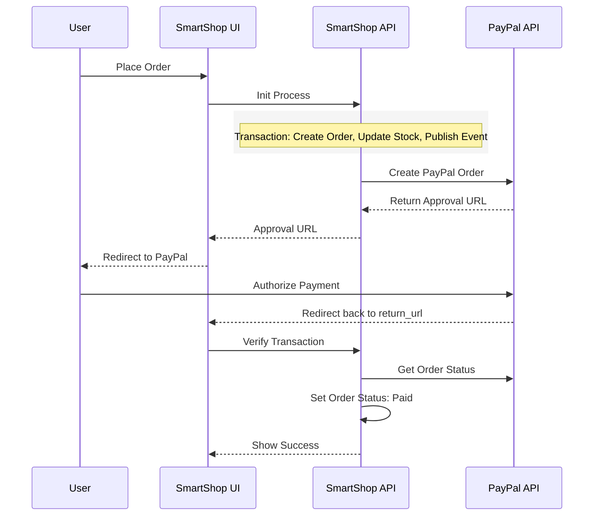

# 🛒 SmartShop - Full-Stack E-commerce Platform

[](https://dotnet.microsoft.com/download)
[](https://angular.io/)
[](https://www.docker.com/)
[](https://opensource.org/licenses/MIT)

## 🚀 Project Overview

SmartShop is a high-performance, modern e-commerce platform built with a focus on scalable architecture and seamless user experience. It features a complete shopping flow from product discovery to secure automated payments.

### Key Features:
- **Comprehensive Product Catalog**: Advanced filtering, search, and category management.
- **Dynamic Shopping Cart**: Real-time updates and stock synchronization.
- **Secure Authentication**: JWT-based identity management with role-based access control.
- **Automated Payments**: Full PayPal integration with secure transaction verification.
- **Event-Driven Messaging**: Asynchronous communication via **RabbitMQ** for order processing and email notifications.
- **Robust Infrastructure**: Containerized with Docker for consistent development and production environments.

---

## 🛠️ Tech Stack

| Component      | Technologies & Tools |
|----------------|----------------------|
| **Backend**    | ASP.NET Core 8, EF Core, Primary Constructors, LINQ |
| **Messaging**  | RabbitMQ, MassTransit (Event Bus) |
| **Authentication** | JWT, Microsoft Identity, PasswordHasher |
| **Service Layer** | Vertical Slice Architecture (planned), Repository Pattern, UoW |
| **Frontend**   | Angular 18, RxJS, SCSS, Responsive Design |
| **Database**   | SQL Server Express, Migrations |
| **DevOps**     | Docker, Docker Compose, .env Configuration |
| **Quality**    | AutoMapper, FluentValidation, XUnit, Integration Tests |

---

## 💳 Business Logic & Payment Flow

The application implements a robust order processing system with dedicated payment provider support.

### Payment Sequence:
1. **Order Creation**: Stock is reserved and cart cleared within a DB transaction.
2. **Init**: Backend creates a PayPal order and returns a secure Approval URL.
3. **Approval**: User is redirected to PayPal's secure authorization site.
4. **Finalization**: PayPal redirect triggers verification and order status update.



---

## ⚙️ Setup & Configuration

<details>
<summary><strong>📋 1. System Requirements</strong></summary>

- **.NET SDK 8.0**
- **Node.js 20.17+** & **Angular CLI 18.2.5**
- **SQL Server Express**
- **RabbitMQ** (running locally at `localhost:5672`)
- **Docker Desktop** (optional, recommended for production-like testing)
- **SendGrid API Key** (for email notifications)

</details>

<details>
<summary><strong>🔑 2. Environment Setup (.env)</strong></summary>

Create a `.env` file in the root directory (`SmartShop/`). Use the following template:

```env
# Database
ConnectionStrings__SmartShopDbConnection=Server=localhost\SQLEXPRESS;Database=SmartShopDb;Trusted_Connection=True;TrustServerCertificate=True;

# JWT
Authentication__JwtKey=your_very_secret_key_minimum_32_chars
Authentication__JwtIssuer=http://localhost:5000
Authentication__JwtExpireDays=2

# Integration Keys
SendGrid__ApiKey=your_sendgrid_key
PayPal__ClientId=your_paypal_client_id
PayPal__Secret=your_paypal_secret

# Infrastructure
RabbitMQ__UserName=guest
RabbitMQ__Password=guest
RabbitMQ__Host=localhost
```

</details>

<details>
<summary><strong>🚀 3. How to Run</strong></summary>

### Option A: Docker (Easiest)
```bash
docker-compose up --build
```
Access UI at: `http://localhost:4288`

### Option B: Local Development
**Backend:**
```bash
cd SmartShopAPI/SmartShopAPI
dotnet run
```
Access Swagger at: `http://localhost:5108/swagger`

**Frontend:**
```bash
cd SmartShopUI/SmartShopUI
npm install
ng serve
```
Access UI at: `http://localhost:4200`

</details>

---

## 👨‍💻 Demo Accounts

Explore the system with pre-configured roles:

| Role  | Email | Password |
|-------|-------|----------|
| **Administrator** | `admin@admin.com` | `admin123` |
| **Standard User** | `user@user.com` | `user1234` |

---

## 📂 Project Documentation

Deep dive into our architectural decisions and refactoring progress:
- [Entity Modeling Standards](file:///C:/Users/rober/.gemini/antigravity/brain/a1693671-7c11-477c-aa27-ab92273ca725/entity_modeling_guide.md)
- [Database Schema (ERD)](file:///C:/Users/rober/.gemini/antigravity/brain/a1693671-7c11-477c-aa27-ab92273ca725/database_erd.md)
- [Detailed Payment Flow](file:///C:/Users/rober/.gemini/antigravity/brain/a1693671-7c11-477c-aa27-ab92273ca725/payment_flow_docs.md)
- [Current Task Tracker](file:///C:/Users/rober/.gemini/antigravity/brain/a1693671-7c11-477c-aa27-ab92273ca725/task.md)